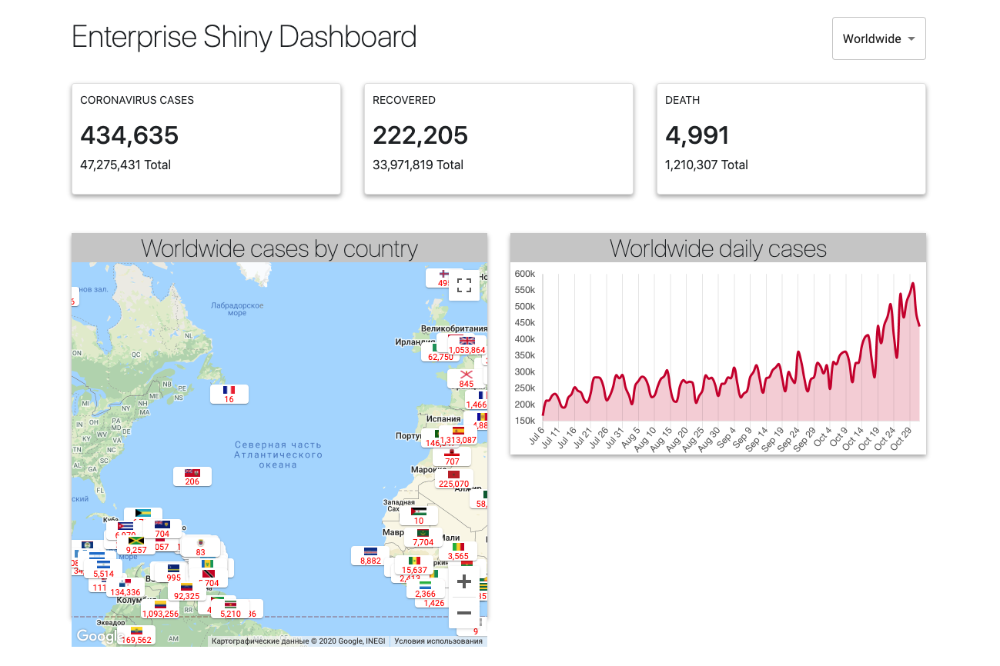

<h2> Applison Dashboard</h2>



## I developed an Applison Dashboard web app using React

## [Live Demo](https://dashboard-appstral.web.app/)

## Technologies

- [React](https://reactjs.org/)
- [React-Hooks](https://reactjs.org/docs/hooks-intro.html)
- [Fetch](https://developer.mozilla.org/en-US/docs/Web/API/Fetch_API/Using_Fetch)
- [Material UI](https://material-ui.com/)
- [Bootstrap](https://getbootstrap.com/)
- [Chart.js](https://www.chartjs.org/)
- [GoogleMaps](cloud.google.com)
- [Numeral](http://numeraljs.com/)
- [Firebase](https://firebase.google.com/)

#### First, Install deps

```bash
$ npm install
#or
$ yarn install
```

#### In the project directory, run the development server::

```bash
$ npm start
#or
$ yarn start
```

Open [http://localhost:3000](http://localhost:3000) with your browser to see the result.
